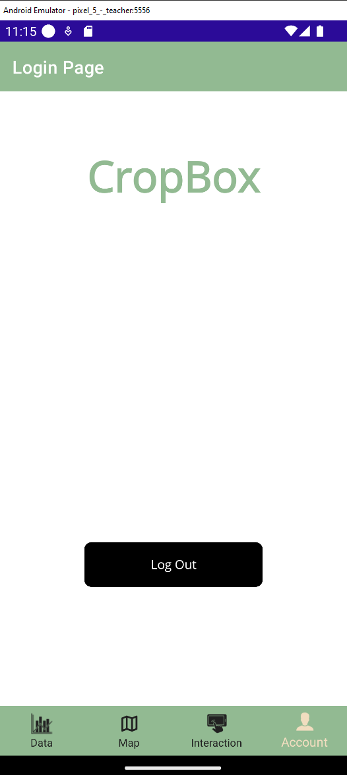
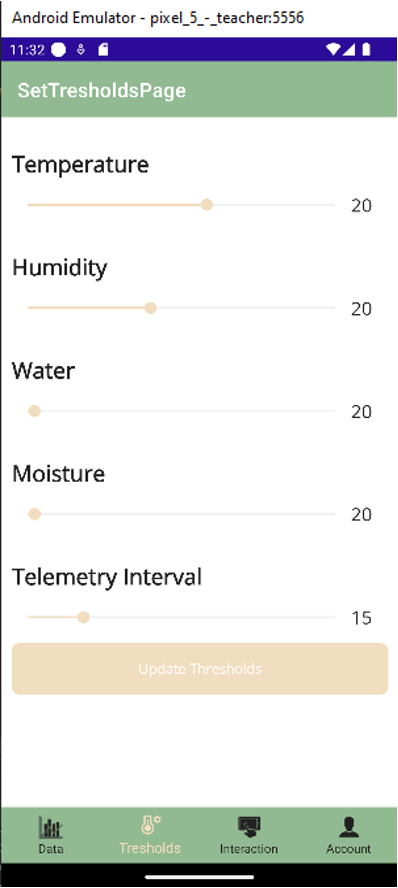

# Crop_Box

## Project Documentation

### **Team Information**

Team Members:

* Name : Gorav Karwer
* Name : Rafael Vincent De Guzman
* Name : Simon Stasovski

### Project Description

CropBox is a digital solution for managing farming containers remotely. It allows fleet owners and technicians to monitor data and control equipment remotely based on their roles. Users can monitor the location, stability of the container, security infrastructure and environmental readings of your containers and make modifications where appropriate.

### Sections required by the Connected Objects course

Temperature :

az iot device send-d2c-message -n {iothub_name} -d {deviceid} --props 'reading-type=Temperature'  --data {"'type'":" 'Temperature'"," 'value'":" 6.840"," 'unit'":" 'C'"\}

Humidity :
az iot device send-d2c-message -n {iothub_name} -d {deviceid} --props 'reading-type=Humidity'  --data {"'type'":" 'Humidity'"," 'value'":" 6.840"," 'unit'":" '% HR'"\}

Vibration:

az iot device send-d2c-message -n {iothub_name} -d {deviceid} --props 'reading-type=Vibration' --data {"'type'":" 'Vibration'"," 'value'":" 46.84015371452148"," 'unit'":" '°'"\}

Roll:

az iot device send-d2c-message -n {iothub_name} -d {deviceid} --props 'reading-type=Roll' --data {"'type'":" 'Roll'"," 'value'":" 0.48365120978239173"," 'unit'":" '°'"\}

Pitch:

az iot device send-d2c-message -n {iothub_name} -d {deviceid} --props 'reading-type=Pitch' --data {"'type'":" 'Pitch'"," 'value'":" -9.011416429359338"," 'unit'":" '°'"\}

Sound:

az iot device send-d2c-message -n {iothub_name} -d {deviceid} --props 'reading-type=Sound' --data {"'type'":" 'Sound'"," 'value'":" 529"," 'unit'":" 'dB'"\}

Water :

az iot device send-d2c-message -n {iothub_name} -d {deviceid} --props 'reading-type=WaterDepth'  --data {"'type'":" 'WaterDepth'"," 'value'":" 56.840"," 'unit'":" 'mm'"\}

Moisture :

az iot device send-d2c-message -n {iothub_name} -d {deviceid} --props 'reading-type=Moisture'  --data {"'type'":" 'Moisture'"," 'value'":" 6.840"," 'unit'":" '% SMC'"\}

Luminosity:

az iot device send-d2c-message -n {iothub_name} -d {deviceid} --props 'reading-type=Luminosity' --data {"'type'":" 'Luminosity'"," 'value'":" 2"," 'unit'":" 'cd'"\}

Motion :

az iot device send-d2c-message -n {iothub_name} -d {deviceid}  --props 'reading-type=Motion' --data {"'type'":"'Door'","'value'":"'motion'","'unit'":"'State'"\}

az iot device send-d2c-message -n {iothub_name} -d {deviceid}  --props 'reading-type=Motion' --data {"'type'":"'Door'","'value'":"'no motion'","'unit'":"'State'"\}

RGBLED:

az iot device send-d2c-message -n {iothub_name} -d {deviceid} --props 'reading-type=RGBLED' --data {"'type'":"'RGBLED'","'value'":"'on'","'unit'":"'State'"\}

az iot device send-d2c-message -n {iothub_name} -d {deviceid} --props 'reading-type=Fan' --data {"'type'":"'RGBLED'","'value'":"'off'","'unit'":"'State'"\}

Fan:

az iot device send-d2c-message -n {iothub_name} -d {deviceid} --props 'reading-type=Fan' --data {"'type'":"'Fan'","'value'":"'on'","'unit'":"'State'"\}

az iot device send-d2c-message -n {iothub_name} -d {deviceid} --props 'reading-type=Fan' --data {"'type'":"'Fan'","'value'":"'off'","'unit'":"'State'"\}

Door :

az iot device send-d2c-message -n {iothub_name} -d {deviceid} --props 'reading-type=Door' --data {"'type'":"'Door'","'value'":"'open'","'unit'":"'State'"\}

az iot device send-d2c-message -n {iothub_name} -d D1 --props 'reading-type=Door' --data {"'type'":"'Door'","'value'":"'closed'","'unit'":"'State'"\}

Buzzer:

az iot device send-d2c-message -n {iothub_name} -d {deviceid} --props 'reading-type=Buzzer' --data {"'type'":"'Buzzer'","'value'":"'on'","'unit'":"'State'"\}

az iot device send-d2c-message -n {iothub_name} -d {deviceid} --props 'reading-type=Buzzer' --data {"'type'":"'Buzzer'","'value'":"'off'","'unit'":"'State'"\}

Lock:

az iot device send-d2c-message -n {iothub_name} -d {deviceid} --props 'reading-type=Lock' --data {"'type'":"'Lock'","'value'":"'on'","'unit'":"'State'"\}

az iot device send-d2c-message -n {iothub_name} -d {deviceid} --props 'reading-type=Lock' --data {"'type'":"'Lock'","'value'":"'off'","'unit'":"'State'"\}

### Mobile App

#### App Overview

* The mobile app enables fleet owners and technicians to remotely monitor data and control equipment according to their respective roles, this system empowers users to oversee container locations, assess container stability with the thresholds, evaluate security infrastructure, and monitor environmental readings.

#### App Setup

1. Follow the guide to Create an IoT hub using the Azure portal (link below).How-to Guide: [Create an IoT hub using the Azure portal](https://learn.microsoft.com/en-us/azure/iot-hub/iot-hub-create-through-portal).
2. Follow the [course notes on creating a Storage Account](https://john-abbott-college.github.io/6P3-Notes/#/lessons/16-blob-storage?id=creating-a-storage-account-amp-container) to create a Storage Account (you pick the name) and a container named checkpoint-blob.
3. This is a step-by-step guide to the configuration needed to run the app. This includes instructions on used connection strings and how to acquire them.In the app, we need to configure the appsettings.json file that contains the following parameters ;

   ```
   "EventHubConnectionString": "",

       "EventHubName": "",

       "ConsumerGroup": "",

       "StorageConnectionString": "",

       "BlobContainerName": "",

       "HubConnectionString": "",

       "DeviceId": "",

       "DeviceConnectionString": ""
   ```

   1. DeviceId:  From the Azure Portal, under IoT Hub > Devices, by clicking on the specific device, copy the name of the specific device. Then copy-paste the in the appsetting.json in the empty quote next to DeviceID.
   2. DeviceConnectionString: From the Azure Portal, under IoT Hub > Devices, by clicking on the specific device(someone for the previous step) > copy the primary connection string. Then copy-paste the primary connection string in the appsetting.json in the empty quote next to DeviceConnectionString.
   3. StorageConnectionString: Navigate to your storage account in the Azure portal. In the Security + networking section, locate the Access keys setting. To display the account keys and associated connection strings, select the Show Keys button at the top of the page. To copy a connection string to the clipboard, select the Copy button to the right of the connection string. Then copy-paste the Storage account connection string in the appsetting.json in the empty quote next to StorageConnectionString.
   4. BlobContainerName.Simply the name of the container you created inside the storage account. The name of the container would be checkpoint-blob copy the name. Then copy-paste the blob container name in the appsetting.json in the empty quote next to BlobContainerName.
   5. EventHubName: From the Azure Portal> under Iot Hub >Select Built-in endpoints from the resource menu, under Hub settings. Under Event Hub-compatible copy the event hub-compatible name. Then copy-paste the event hub-compatible name in the appsetting.json in the empty quote next to EventHubName.
   6. EventHubConnectionString: From the Azure Portal> under Iot Hub >Select Built-in endpoints from the resource menu, under Hub settings. Under the Event Hub-compatible endpoint copy the event Hub-compatible endpoint. Then copy-paste it into the appsetting.json in the empty quote next to EventHubConnectionString.
   7. ConsumerGroup: Enter ‘$Default’  in the appsetting.json in the empty quote next to ConsumerGroup
   8. HubConnectionString: From the Azure Portal> under Iot Hub > Under security Setting > select the Shared access policies > Click the Add shared access policy> under Access policy name write registryReadWrite and enable the read and write registry. Click on the new registryReadWrite and copy and paste the Primary connection string of registryReadWrite into the appsetting.json in the empty quote next to HubConnectionString.

#### Authentication

1. Go to [https://console.firebase.google.com/](https://console.firebase.google.com/)
2. Once the project is created, you will land in the main Firebase dashboard.
3. Scroll down and click on the Authentication block.
4. Click on Get Started to enable authentication and display the list of providers.Under native click Email/Password Enable > Save.
5. Go to the Users tab > Add two users manually

   1. email: {name}@tech.cropbox.com
   2. password:  your choice
   3. email: {name}@owner.cropbox.com
   4. password:  your choice
6. Get value from Firebase portal > Go to the Settings tab (while being in Authentication). Under Authorized domains > copy the Firebase App domain (usually second entry)
   Example: mauifitness-?????.firebaseapp.com
   And paste it into ResourceStrings.cs file for the parameter AuthorizedDomain

   Get value from Firebase portal > Go to the Settings tab (while being in Authentication). Under Authorized domains > copy the Firebase App domain (usually second entry)
7. Get value from Firebase portal > Left Navigation > Click on the gear icon  next to Project Overview
8. Select Project Settings > Under General tab > Web API Key and copy it
9. Paste it into ResourceStrings.cs file for the parameter Apikey

### App Functionality

##### Login./Logout



The user will be prompted to log in on the
landing page. The user cannot view any more views until they properly log in. If the logged-in user is a technician, they will only have access to the
technician's views. If the logged-in user is the owner of a fleet, they will see their devoted user. And Both users are able to logout.

#### Fleet Owner View

##### Owner Map View:


This view allows the owner to see the location of their container on a map.


##### Owner Data View:

This view shows the container's present condition like the pitch, roll , vibration and luminosity, and moisture level.
There are the colours in the gauge represented how close the reading is to the threshold value. For instance, green represents a reading within 0-75% of the
threshold, Yellow represents a reading within 75-90% of the threshold and red represents a reading within 90% or more of the threshold.


In addition, you can choose the specific information want to see.


#### Technician  View

##### Technician Threshold View:

The technician may modify the threshold value for the temperature, humidity, water level, and moisture level to suit
his needs.




##### Technician Data View:

This view shows the container's present condition like the temperature, humidity, water depth and moisture, and
moisture level. There are the colours in the gauge represented how close the reading is to the threshold value. For instance, green represents a reading within 0-75% of the threshold, Yellow represents a reading within 75-90% of the threshold and red represents a reading within 90% or more of the threshold.


In addition, you can choose the specific information want to see.


#### Share View

This View will show historical logs of reading that are not shown on other pages and they can filter through the logs.
In addition, they can manually toggle actuators. However, the owner is allowed the door lock and buzzer actuators, and the technician is allowed the door ,
buzzer, rgb led and fan actuators.   They can also monitor their states over time.


## Future Work

- Repair the
  app's crash when there is no Internet connection, however, the App notifies
  users to the Internet is disconnected
- Add a
  serviceRepo to loosen the app's connection to the repo.
- Configure the
  authentication procedure so that the user may use any email, but we need to
  know if the user is an owner or a technician.
- Make D2C and
  C2D messages more efficient (use fewer messages)
- Change RGBLED
  behaviour to static lights on and off
- Add icon for
  the App

## Contribution


| Simon                   | Gorav                                         | Rafael                      |
| ----------------------- | --------------------------------------------- | --------------------------- |
| Geolocation Subsystem   | Security Subsystem                            | Plant Subsystem             |
| Firebase Authentication | Documentation                                 | Telemetry App               |
| Desired Properties      | Filtering the data(in the App) for the Device | Direct Method App to Device |
| Pair programming        | Pair programming                              | Pair programming            |
