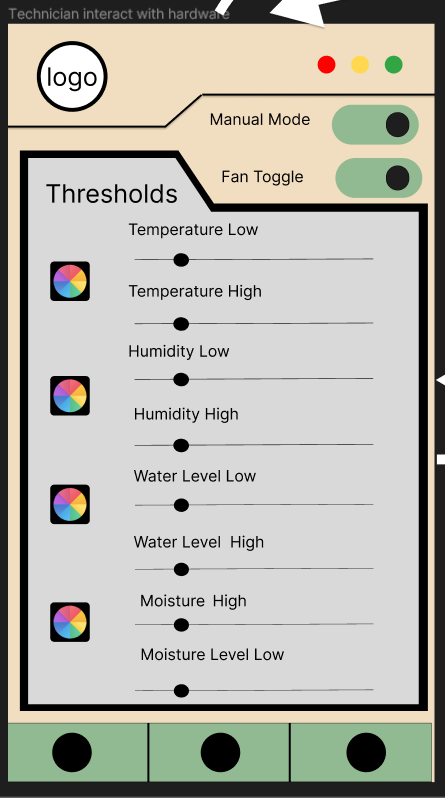
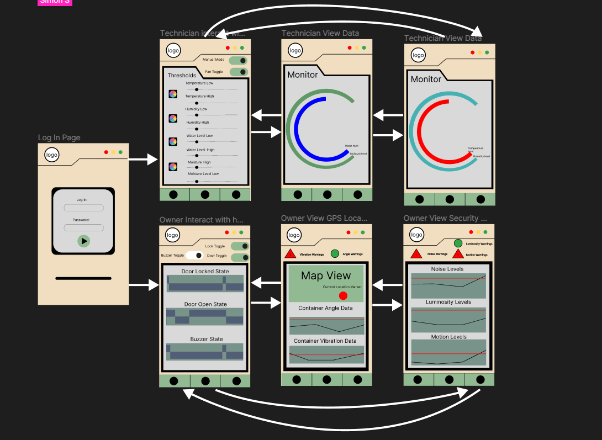

# Functional Overview

CropBox is a digital solution to managing farming containers remotely. It allows fleet owners and technicians to monitor data and control equipment remotely based on their roles. Users can monitor the location, stability of the container, security infrastructure and environmental readings of your containers and make modifications where appropriate.

## Design Overview

### Common View

#### Login View

The landing page will prompt the user to log in. The user can not not access any other page until they log in successfully. The user will see a list view of their containers. If the logged-in user is a technician, they will only have access to the views associated with the technician. If the logged-in user is a fleet-owner, then they will see their dedicated user.

### Technician View

#### Threshold View

The technician will be sent to the threshold page after choosing the desired container, where he may modify the threshold value for the temperature, humidity, water level, and moisture level to suit his needs. The button to change the warning LED's color is also located next to the slider. Also, a manual mode toggle allows the technician to override the threshold setting and to use the fan toggle to turn on or off the fan.

#### Monitors views

The technician may view the container's present condition like the temperature, humidity, water level, and moisture level on two different pages. The first page will show the temperature and humidity readings on a gauge chart and on the second page as well show  the water level and moisture readings on a gauge chart.

### Fleet Owner View

#### Manual Interaction View

If the logged in user is a fleet owner, they will be shown the list view like the technicians. Once they choose a container, they will land on the hardware interaction page. In this page, they can manually toggle the states (ON/OFF) of the buzzer, door and door lock. They can also monitor their states over time.

#### Location and Staibility View

The fleet owner can use the nav bar to navigate to two other pages and back to this page. The first of the two pages is the location and stability view which allows the user to view the location of their container on a map. Also, the user can see the angle and vibration data of their container in the form of graphs and get warnings if the container is too unstable.

#### Noise, Light and Motion Data View

The other page is the telemetry view which allows the user to view data on the noise, luminosity and motion levels inside the container. It also displays how many times the noise, luminosity or motion have exceeded the expected amount.

## App Prototype

## **Prioritization of Features**

1 - Must develop.

2 - Would like to develop.

3 - Could develop if time permits.

4 - Likely would not develop because of lack time or knowledge.

### As the farm technician, I want to know the environmental conditions inside the container in near real-time so that I can make necessary adjustments.

* CBOX-8 As the farm technician, I want to be able to measure the temperature inside the container so that I can monitor the environment that my plants are in.
  * 1
* CBOX-9 As the farm technician, I want to be able to measure relative water levels inside the water tank so that I can assure that there is an appropriate amount of water in the water tank
  * .1
* CBOX-10 As the farm technician, I want to be able to measure soil moisture levels so that I can easily monitor the water content/soil moisture of the soil
  * 1
* CBOX-19 As the farm technician, I want the LED light to use a colour scheme for the type of issue the container has so that I can more easily troubleshoot the issue
  * .2
* CBOX-24 As the farm technician, I want to be able to measure the humidity inside the container so that I can monitor the environment that my plants are in.
  * 1
* CBOX-27 As the farm technician, I want to be notified when the temperature is within a user defined range from the threshold so that I am warned if the temperature is too close to the threshold.
  * 2
* CBOX-28 As the farm technician, I want to be notified when the humidity is within a user defined range from the threshold so that I am warned if the humidity is too close to the threshold.
  * 2
* CBOX-29 As the farm technician, I want to be notified when the water levels are within a user defined range from the threshold so that I am warned if the water levels are too close to the threshold.
  * 2
* CBOX-30 As the farm technician, I want to be notified when the moisture is within a user defined range from the threshold so that I am warned if the moisture is too close to the threshold.
  * 2
* CBOX-32 As the farm technician, each reading should have a low and high threshold that is user defined so that I can monitor extreme readings in either direction.
  * 1
* CBOX-33 As the farm technician, I want to be alerted when the temperature is equal to or higher than the threshold so that I can know when to take immediate action.
  * 2
* CBOX-34 As the farm technician, I want to be alerted when the humidity is equal to or higher than the threshold so that I can know when to take immediate action.
  * 2
* CBOX-35 As the farm technician, I want to be alerted when the moisture is equal to or higher than the threshold so that I can know when to take immediate action.
  * 2
* CBOX-36 As the farm technician, I want to be alerted when the water levels are equal to or higher than the threshold so that I can know when to take immediate action.
  * 2
* CBOX-26 As the farm technician, I want to be able to share my results based on a time frame so that I can export trends data inside of the container.
  * 3
* CBOX-25 As the farm technician, I want to be able to share my results based on the sensors so that I can show the container conditions to the appropriate individuals.
  * 3

### As the farm technician, I need to be able to control the environmental conditions inside the container to make sure that plants are healthy.

* CBOX-18 As the farm technician, I want to be able to put a custom temperature threshold so that the fan starts once the temperature hits or exceeds the threshold (high).
  * 1
* CBOX-20 As the farm technician, I want to be able to put humidity thresholds (low and high) so that the LED turns green if the humidity hits or exceeds either threshold.
  * 1
* CBOX-21 As the farm technician, I want to be able to put two water thresholds (low and high) so that the LED turns blue if the water level hits or exceeds either threshold.
  * 1
* CBOX-22 As the farm technician, I want to be able to put two moisture thresholds (low and high) so that the LED turns yellow if the moisture hits or exceeds either threshold.
  * 1
* CBOX-23 As the farm technician, I want to be able to put two custom temperature thresholds (high and low) so that the LED turns red if the temperature hits or exceeds either threshold.
  * 1
* CBOX-31 As a farm technician, I want to be able to  manually toggle the fan so that I can fine tune the temperature and humidity manually.
  * 3
* CBOX-53 As the farm technician, I want to be able to put a custom humidity threshold so that the fan starts once the temperature hits or exceeds the threshold (high).
  * 1

### As the fleet inverter / owner, I want to know the location and placement of the container farms so that I can track company assets.

* CBOX-5 As the fleet inverter / owner, I want to view the location of each container on my phone so that I can easily track their location during transportation.
  * 1
* CBOX-6 As the fleet inverter / owner, I want to be able to view the pitch and roll angles of each container on my phone so that I can track the stability and integrity of my containers during the transportation process.
  * 1
* CBOX-7 As the fleet inverter / owner, I want to view the vibration level data of each of my containers on my phone so that I can monitor the integrity of my container during the transportation.
  * 1
* CBOX-38 As the fleet inverter / owner, I want the reterminal's buzzer to sound for a long period if the angle of the container is not within a neutral position so that technicians can be notified of the issue.
  * 1
* CBOX-39 As the fleet inverter / owner, I want the reterminal's buzzer beep for a minute if the container is vibrating so that technicians can be notified of the issue.
  * 1
* CBOX-40 As the fleet inverter / owner, I want the location of the container saved every 15 minutes so that I can track it in case an unfortunate event happens to the container
  * 1
* CBOX-55 As a fleet owner, I want visual warning messages for every time angle and stability go above normal levels so that I can better track strange events.
  * 4

### As the fleet owner, I want to be informed of security issues inside the container farm so that I can mobilise an appropriate response.

* CBOX-37 As the fleet owner, I want to be able to be notified of unusually loud or high noise levels so that I can be notified of any possible emergency incident.
  * 1
* CBOX-41 As a fleet owner, I want to receive real-time notifications on my phone when the PIR motion sensor detects movement inside the container farm, so that I can mobilise an appropriate response to any potential security threat.
  * 1
* CBOX-42 As a fleet owner, I want to receive alerts when the magnetic door sensor reed switch is triggered, so that I can be informed if someone tries to enter or exit the container farm without authorization.
  * 1
* CBOX-43 As a fleet owner, I want to be able to remotely control the MG90S 180° micro servo to lock or unlock the doors of the container farm, so that I can prevent unauthorised access or allow access to authorised personnel.
  * 1
* CBOX-44 As a fleet owner, I want to receive notifications when the sound sensor/noise detector detects loud or unusual sounds inside the container farm, so that I can investigate and respond accordingly to any potential security breach.
  * 1
* CBOX-45 As a fleet owner, I want to view light sensor data, so that I can monitor the luminosity levels inside the container farm and receive alerts in case of any unusual light levels.
  * 2
* CBOX-46 As a fleet owner, I want to view noise level data, so that I can monitor the security of the container.
  * 2
* CBOX-47 As a fleet owner, I want to view luminosity level data, so that I can monitor the security of the container.
  * 2
* CBOX-49 As a fleet owner, I want to view motion data, so that I can monitor the security of the container
  * 2
* CBOX-50 As a fleet owner, I want to be able to integrate the security system with a remote monitoring platform, so that I can access real-time security data and respond to any security issues from anywhere, at any time
  * 1
* CBOX-52 As a fleet owner, I want a continuous buzzer sound to come from the reterminal if there is any type of breach, so that professionals in the area can react.
  * 2
* CBOX-54 As a fleet owner, I want visual warning messages for every time noise, luminosity and motion go above normal levels so that I can better track strange events.
  * 4

## Potential Showstoppers and Open Questions

Fleet of cropboxes, or only having one box to build an app on (we are guessing that we only have one raspberry to work with)

* crud for boxes if multi?

Having custom nav bars for each user type.

Databases? How are we going to persist data and is it through Azure or other? Are we even going to store data in this app? localdata?

The header design could be challenging to implement.

Implementing all the different types of graphs. Do certain types of graphs that we need exist?

Using the GPS in the application.

Should we use MVVM, MVP or MVC?

What data should we send to azure? Can we keep thresholds in the application?
